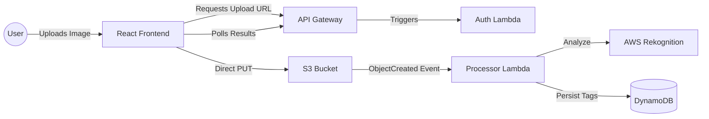

# Serverless AI Image Tagger


## 🎯 Vision & Business Value

This project demonstrates a fully **Serverless, Event-Driven Architecture** for automated media analysis.
Unlike traditional container-based solutions, this architecture generates **Zero Idle Costs**. It scales to zero when not in use and scales practically infinitely under load.

**Key Value Propositions:**
* **Automation:** Eliminates manual tagging of media assets using AWS Rekognition.
* **FinOps:** Uses a "Pay-per-Value" model (Lambda, DynamoDB On-Demand).
* **Operations:** NoOps approach – no servers to patch, no clusters to manage.

---

## 🤖 The "AI-Augmented" Team Structure

This project explores modern software engineering by treating AI not just as a tool, but as an integral part of the project team. I acted as the **Lead Architect**, orchestrating two AI agents to deliver a production-grade prototype within a 2-week sprint.

| Role | Agent / Human | Responsibilities |
| :--- | :--- | :--- |
| **Lead Architect & PO** | **[Dein Name]** (Human) | Architecture Design, Security Decisions, Code Review, Prompt Engineering, Business Logic Definition. |
| **Strategic Advisor** | **Gemini (Google)** | Requirements Engineering (WBS), FinOps Analysis, Roadmap Planning, "Challenger" for Architectural Decisions. |
| **Implementation Partner** | **GitHub Copilot** | Writing Boilerplate Code, Unit Test Scaffolding, Syntax Generation (AWS CDK & React). |

> *"The AI writes the code, but the Architect sets the constraints."*

---

## 🏗️ Architecture

The system relies on an asynchronous, decoupled event flow.


### Key Architectural Decisions:
1.  **Infrastructure as Software:** All resources are defined in **TypeScript (AWS CDK)**, allowing type-safe infrastructure definitions and logic sharing between backend and infra code.
2.  **Strict Separation of Concerns:**
    * **Frontend:** Handles only UI state and direct S3 uploads (Presigned URLs) to offload traffic from the backend.
    * **Backend:** Purely event-driven. The image processing is decoupled from the user upload.
3.  **Security First:**
    * **OIDC:** GitHub Actions deploy via OpenID Connect (no long-lived AWS Access Keys).
    * **Least Privilege:** Lambdas have strictly scoped IAM roles (e.g., `rekognition:DetectLabels` only).

---

## 🛠️ Tech Stack

* **Cloud Provider:** AWS (Serverless focus)
* **IaC:** AWS CDK v2 (TypeScript)
* **Backend:** Node.js 20.x (AWS SDK v3 for modularity & performance)
* **Frontend:** React + Vite + TypeScript
* **CI/CD:** GitHub Actions (Automated Deploy & Destroy Pipelines)
* **Dev Environment:** Docker DevContainer (ensures reproducible builds)

---

## 🚀 How to Run

### Prerequisites
You do not need to install Node.js or AWS CLI locally if you use Docker.

1.  **Clone the Repo:**
    ```bash
    git clone [https://github.com/Gh0stbasta/serverless-ai-image-tagger.git](https://github.com/Gh0stbasta/serverless-ai-image-tagger.git)
    ```
2.  **Open in DevContainer:**
    Open the folder in VS Code. When prompted "Reopen in Container", click **Yes**.
    *This spins up a Docker container with Node 20, AWS CLI, and CDK pre-installed.*

### Deployment
1.  **Configure Credentials:**
    Run `aws configure` inside the terminal (or ensure environment variables are set).
2.  **Deploy:**
    ```bash
    cd infra
    npm install
    npx cdk deploy
    ```

---

## 💰 Cost Analysis (FinOps)

This architecture is designed to stay within the **AWS Free Tier** for development.

* **Compute (Lambda):** Free Tier includes 400,000 GB-seconds / month.
* **Database (DynamoDB):** Free Tier includes 25 GB storage.
* **AI (Rekognition):** Free Tier includes 1,000 images / month (First 12 months).
* **Storage (S3):** Standard rates apply after Free Tier (approx. $0.023/GB).

**Protection:** A `Budget Alarm` is configured to notify admins via SNS if costs exceed $5.00/month.
