# Serverless AI Image Tagger


---

## 🚀 Live Demo

**Try it now:** [https://d3hfasj4qo0ao2.cloudfront.net](https://d3hfasj4qo0ao2.cloudfront.net)

Upload any image and watch as AWS Rekognition automatically detects objects, scenes, and labels in real-time. The fully serverless architecture processes your image on-demand with zero cold start delays for optimal user experience.

---

## 🎯 Vision & Business Value

This project demonstrates a production-grade **Serverless, Event-Driven Architecture** for automated media analysis.
Unlike traditional container-based solutions, this architecture generates **Zero Idle Costs**. It scales to zero when not in use and scales practically infinitely under load.

### Why This Matters

**💰 Cost Efficiency: Pay-per-Value Model**
* **Zero idle costs** – No servers running 24/7 waiting for requests
* **Serverless billing** – Pay only for actual compute time (Lambda) and API requests
* **On-Demand DynamoDB** – Charged only for read/write operations performed
* **Free Tier eligible** – Stays within AWS Free Tier for development workloads
* **Budget protection** – Automated cost alerts prevent unexpected charges

**📈 Scalability: Automatic & Infinite**
* **Elastic scaling** – Handles 1 request or 10,000 requests/sec without configuration changes
* **No capacity planning** – AWS manages all scaling decisions automatically
* **Global reach** – CloudFront CDN delivers frontend assets with low latency worldwide
* **Concurrent processing** – Each image upload triggers independent Lambda execution

**🤖 Automation: Fully Event-Driven Pipeline**
* **Zero manual intervention** – Upload triggers automatic AI analysis via S3 events
* **Async processing** – Users aren't blocked waiting for AI analysis to complete
* **Decoupled architecture** – Frontend, API, and processing layers scale independently
* **NoOps deployment** – Infrastructure as code eliminates manual AWS console clicking

---

## 🤖 The "AI-Augmented" Team Structure

This project explores modern software engineering by treating AI not just as a tool, but as an integral part of the project team. I acted as the **Lead Architect**, orchestrating two AI agents to deliver a production-grade prototype within a 2-week sprint.

| Role | Agent / Human | Responsibilities |
| :--- | :--- | :--- |
| **Lead Architect & PO** | **Stefan Schmidpeter** (Human) | Architecture Design, Security Decisions, Code Review, Prompt Engineering, Business Logic Definition. |
| **Strategic Advisor** | **Gemini (Google)** | Requirements Engineering (WBS), FinOps Analysis, Roadmap Planning, "Challenger" for Architectural Decisions. |
| **Implementation Partner** | **GitHub Copilot** | Writing Boilerplate Code, Unit Test Scaffolding, Syntax Generation (AWS CDK & React). |

> *"The AI writes the code, but the Architect sets the constraints."*

---

## 🏗️ Architecture

The system is built on an **asynchronous, event-driven** architecture where each component operates independently and communicates through AWS-managed event buses. This design eliminates tight coupling and enables infinite horizontal scaling.

```mermaid
graph TB
    User([👤 User]) -->|1. Upload Image| S3[📦 S3 Bucket<br/>Image Storage]
    S3 -->|2. ObjectCreated Event| Lambda[⚡ Lambda Function<br/>Image Processor]
    Lambda -->|3. Analyze Image| Rekognition[🤖 Amazon Rekognition<br/>AI Analysis]
    Lambda -->|4. Store Metadata & Tags| DynamoDB[(🗄️ DynamoDB<br/>NoSQL Database)]
    User -->|5. Query Results| API[🌐 API Gateway<br/>HTTP API]
    API -->|6. Fetch Tags| DynamoDB
    
    style User fill:#e1f5ff
    style S3 fill:#ffd9b3
    style Lambda fill:#ffeb99
    style Rekognition fill:#d4f1d4
    style DynamoDB fill:#e6ccff
    style API fill:#ffe6e6
```



### Workflow Explanation

1. **User uploads an image** to the React frontend
2. **Frontend requests a presigned URL** from API Gateway and uploads directly to **S3** (bypassing backend for efficiency)
3. **S3 emits an ObjectCreated event** that automatically triggers the **Lambda Processor**
4. **Lambda invokes AWS Rekognition** to perform AI-powered image analysis
5. **Lambda stores detected labels and metadata** in **DynamoDB** for persistence
6. **User can query results** via the frontend, which calls API Gateway to retrieve data from DynamoDB

### Key Architectural Decisions

1.  **Infrastructure as Software:** All resources are defined in **TypeScript (AWS CDK)**, enabling type-safe infrastructure definitions and code reuse between backend and infrastructure layers.
2.  **Strict Separation of Concerns:**
    * **Frontend:** Handles only UI state and direct S3 uploads via presigned URLs, offloading traffic from the backend
    * **Backend:** Purely event-driven. Image processing is fully decoupled from the user upload flow
    * **Processing:** Asynchronous Lambda execution prevents blocking and enables independent scaling
3.  **Security First:**
    * **OIDC Federation:** GitHub Actions deploy via OpenID Connect (eliminates long-lived AWS Access Keys)
    * **Least Privilege IAM:** Each Lambda has strictly scoped permissions (e.g., `rekognition:DetectLabels` only for the processor)
    * **Presigned URLs:** Direct S3 uploads avoid exposing backend credentials to the client

---

## 🛠️ Tech Stack

* **Cloud Provider:** AWS (Serverless focus)
* **IaC:** AWS CDK v2 (TypeScript)
* **Backend:** Node.js 20.x (AWS SDK v3 for modularity & performance)
* **Frontend:** React + Vite + TypeScript
* **CI/CD:** GitHub Actions (Automated Deploy & Destroy Pipelines)
* **Dev Environment:** Docker DevContainer (ensures reproducible builds)

---

## 🚀 How to Run

### Prerequisites

* Docker Desktop installed and running
* VS Code with the "Dev Containers" extension

---

### Quick Start with DevContainer

The **DevContainer** provides a pre-configured development environment with all dependencies installed, ensuring consistent builds across different machines.

1.  **Clone the Repository:**
    ```bash
    git clone https://github.com/Gh0stbasta/serverless-ai-image-tagger.git
    cd serverless-ai-image-tagger
    ```

2.  **Open in DevContainer:**
    * Open the project folder in VS Code
    * When prompted with "Folder contains a Dev Container configuration file", click **Reopen in Container**
    * Alternatively, press `F1` → type `Dev Containers: Reopen in Container`
    
    *This creates a Docker container with Node.js 20, AWS CLI, Python 3.11, and CDK pre-installed.*

3.  **Verify DevContainer Setup:**
    ```bash
    node --version   # Should show v20.x
    aws --version    # Should show aws-cli/2.x
    cdk --version    # Should show AWS CDK version
    ```

---

### Deployment to AWS

1.  **Configure AWS Credentials:**
    
    Inside the DevContainer terminal, run:
    ```bash
    aws configure
    ```
    
    Enter your AWS credentials:
    * **Access Key ID:** Your AWS access key
    * **Secret Access Key:** Your AWS secret key
    * **Region:** `us-east-1` (or your preferred region)
    * **Output format:** `json`

2.  **Bootstrap CDK (First-time only):**
    
    If this is your first time deploying CDK in this AWS account/region:
    ```bash
    cd infra
    cdk bootstrap
    ```

3.  **Install Dependencies:**
    ```bash
    npm run install-all
    ```

4.  **Deploy the Stack:**
    ```bash
    npm run deploy
    ```
    
    * Review the IAM and security changes when prompted
    * Type `y` to confirm deployment
    * Deployment typically takes 3-5 minutes

5.  **Retrieve Stack Outputs:**
    
    After deployment completes, note the CloudFormation outputs:
    * **ApiEndpoint:** Your API Gateway URL
    * **WebsiteURL:** Your CloudFront distribution URL
    * **ImageBucket:** Your S3 bucket name

---

### Cleanup (Destroy Resources)

To avoid ongoing AWS charges, destroy the stack when done:

```bash
cd infra
cdk destroy
```

This removes all AWS resources **except** the S3 bucket (which requires manual deletion if it contains objects).

---

## 💰 Cost Analysis (FinOps)

This architecture is designed to stay within the **AWS Free Tier** for development.

* **Compute (Lambda):** Free Tier includes 400,000 GB-seconds / month.
* **Database (DynamoDB):** Free Tier includes 25 GB storage.
* **AI (Rekognition):** Free Tier includes 1,000 images / month (First 12 months).
* **Storage (S3):** Standard rates apply after Free Tier (approx. $0.023/GB).

**Protection:** A `Budget Alarm` is configured to notify admins via SNS if costs exceed $5.00/month.
